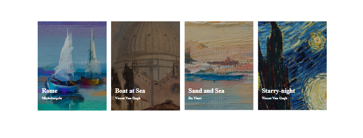
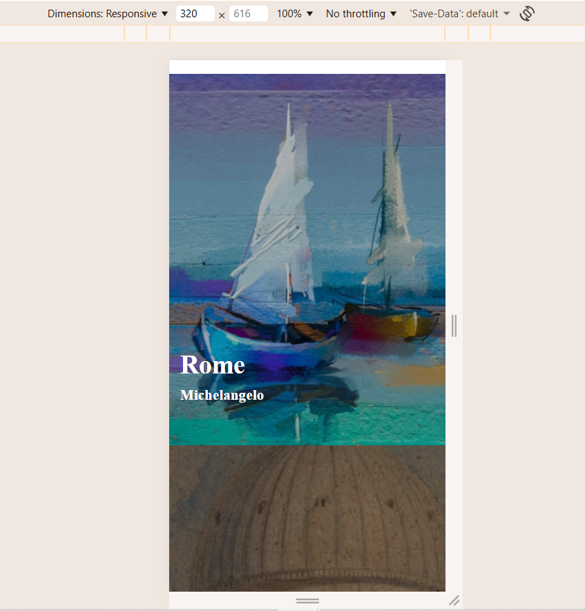

# Lista de imagens

The purpose of this project is to create a responsive list of images.

[Page Link](https://carlab09.github.io/lista-de-imagens/)

#### Results:
*  View the optimal layout for the page depending on their device's screen size

#### Technologies used:
*  HTML
*  CSS

## Conclusion

I am very pleased to have completed this project.

#### Design_Desktop:

#### Design_Mobile:

